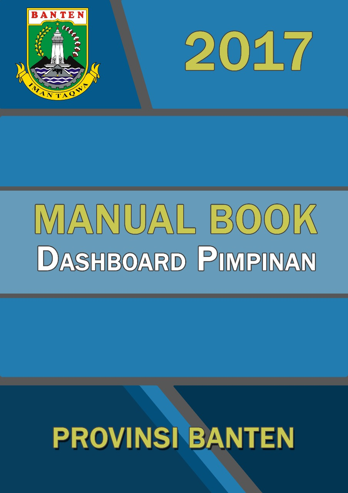
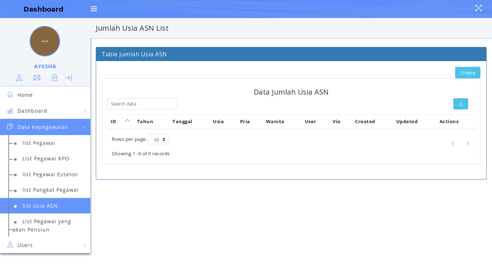
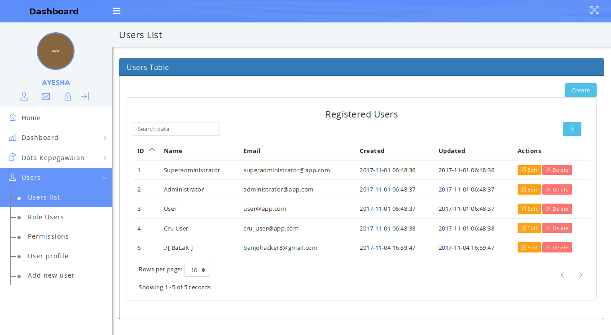

Document manual book ini dibuat untuk memberikan panduan penggunaan aplikasi **Dashboard Pimpinan**, dimana Aplikasi Dashboar Pimpinan adalah aplikasi antar muka untuk monitoring dan mempermudah pimpinan untuk melihat dan menilai kinerja SKPD (Satuan Kerja Perangkat Daerah). Perangkat lunak yang di butuhkan untuk pengujian aplikasi adalah Ubuntu 17 sebagai Operasi System. Sumber daya manusia untuk menggunakan aplikasi ini terutama dari Pimpinan dinas Provini Banten, untuk penggunaan aplikasi ini terlebih dahulu diberikan pengenalan dan pelatihan yang cukup untuk menggunakan aplikasi *Dashboard Pimpinan*.

### 1. Struktur Menu
Adapun struktur menu pada aplikasi Dashboard Pimpinan adalah sebagai berikut:
#### 1.1 **Menu Home**

#### 1.2. **Menu Dashboard**
- **Kepegawaian**

#### 1.3. **Menu Data Kepewaian**
- **List Pegawai**
- **List Pegawai KPO**
- **List Pegawai Esselon**
- **List Usia ASN**
- **List Pegawai Yang Akan Pensiun**

#### 1.4. **Menu Users**
- **Users List**
- **Role User**
- **User Profile**
- **Permissions**
- **Add new user**

Untuk memulai akses terhadap aplikasi **Dashboard Pimpinan**. Buka web browser (IE, Mozilz Firefox atau yang lainnya) dengan menulis alamat url http://dashboard.bangunbanten.com kemudian tekan **Enter** pada tobol keyboard atau klik tombol **Go** pada browser. Akan muncul tampilan halaman login aplikasi dashboard seperti gambar dibawah ini.

**Gambar 1. Tampilan Login**

Masukkan User Id dan Password, Setelah di isi lenkap dan benar, klik button **Log in** atau tekan tombol **Enter** pada keyboard. Sehingga akan menampilkan halaman utama sebagai berikut.

**Gambar 2. Tampilan Awal**

#### 2. Menu Home
Halaman muka (home) Dashboard Pimpinan Menampilkan 4 grafik:

- *Dashboard Kepegawaian*
- *Dashboard Kependudukan*
- *Dashboard Kesehatan*
- *Dashboard Kependidikan*

Seperti ditunjukan pada gambar berikut ini:

**Gambar 3. Halaman Utama (Home)**

Untuk menampilkan detail dashboard Kepegawaian dengan mengklik tombol **view more**.
maka akan ditampilkan detail grafik Jumlah pegawai, Kenaikan pangkat pegawai otomatis, Pegawai yang akan pensiun.Seperti ditunjukan pada gambar berikut ini:

**Gambar 4. Detail Prosentase dan Grafik Jumlah Pegawai**

**Gambar 5. Detail Prosentase dan Grafik Kenaikan Pangkat Pegawai Otomatis**

**Gambar 6. Detail Prosentase dan Grafik Pensiun Pegawai**

#### 3. Menu Dashboard
Didalam menu dashboard ada beberapa cakupan diantaranya *Kepegawaian* (yang didalamnya mencakup jumlah pegawai, kenaikan pangkat pegawai otomatis, pegawai yang akan pensiun).dengan mengklik tombol kepegawaian sistem aplikasi akan menampilkan seperti ditujukan pada gambar dibawah ini:

**Gambar 7.Prosentase dan Grafik Jumlah Pegawai**

**Gambar 8. Prosentase dan Grafik Kenaikan Pangkat Pegawai Otomatis**

**Gambar 9. Prosentase dan Grafik Pensiun Pegawai**

#### 4. Menu Data Kepegawaian
Pengguna atau Pimpinan dengan mengklik tombol Menu Data Kepegawaian akan melihat bagian isi menu diantaranya adalah:
- **List Pegawai.**
Dimana pimpinan bisa melihat data dari seluruh jumlah Pegawai, yang ada diseluruh Dinas Provinsi Banten.
- **List Pegawai KPO**
Dimana pimpinan bisa melihat data dari seluruh jumlah Pegawai KPO (Kenaikan Pangkat Otomatis), yang berada diseluruh Dinas Provinsi Banten.
- **List Pegawai Esselon**
Dimana pimpinan dapat melihat data dari seluruh jumlah pegawai Esselon, yang berada diseluruh Dinas Provinsi Banten.
- **List Usia ASN**
Dimana pimpinan dapat melihat data dari seluruh jumlah pegawai usia ASN, yang berada diseluruh Dinas Provinsi Banten.
- **List Pegawai Yang Akan Pensiun**
Dimana pimpinan dapat melihat data dari seluruh jumlah Pegawai yang akan pensiun, yang berada diseluruh Dinas Provinsi Banten.
Bila pengguna atau Pimpinan mengklik dari menu yang ada, akan menampilkan gambar
seperti dibawah ini:

**Gambar 10. List Data Pegawai**

**Gambar 11. List Data Pegawai Kenaikan Pangkat Otomatis**

**Gambar 12. List Data Jumlah Pegawai Esselon**

**Gambar 13. List Data Jumlah Usia ASN**

**Gambar 14. List Data Jumlah Pegawai Yang Akan Pensiun**

#### 5. Menu Users
Menu Users adalah yang dipergunakan untuk Superadmin dan Admin, dimana bisa untuk Input, Hapus, Edit, Update, View data yang ada, Didalam menu users ada beberapa bagian isi, diantaranya adalah:

- **Users List**
- **Role User**
- **Permissions**
- **Add New User**

Dengan mengklik bagian dari isi menu User sistem aplikasi akan menampilkan gambar seperti dibawah ini:

**Gambar 15. List Tabel Admin**

Klik tombol Create, sistem aplikasi akan menampilakan gambar di bawah ini

**Gambar 16. Form Tabel Add New User**

**Gambar 17. List Lore User**

Klik tombol Create, sistem aplikasi akan menampilakan gambar di bawah ini.

**Gambar 18. Form Tabel Add Role User**

**Gambar 19. List Permissions**

Klik tombol Create, sistem aplikasi akan menampilakan gambar di bawah ini.

**Gambar 20. Form Tabel Add Permissions**

Klik tombol Add New User, sistem aplikasi akan menampilakan gambar di bawah ini.

**Gambar 21. Form Tabel Add New User**

