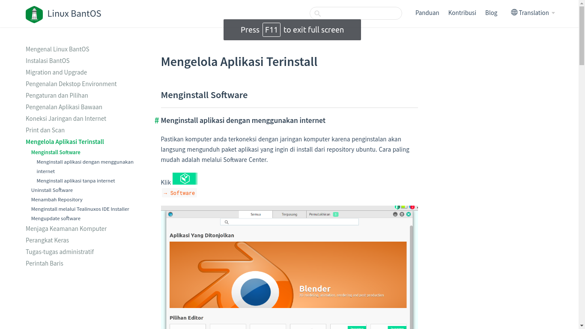
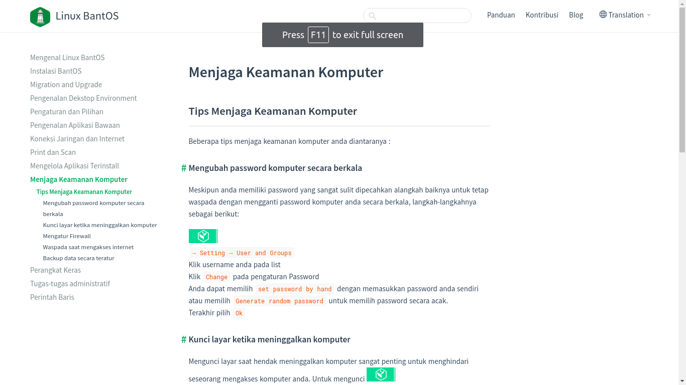
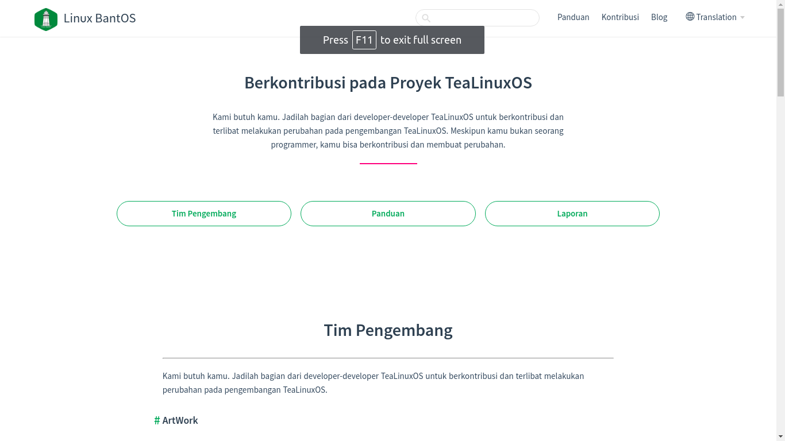

# Linux BantOS

Linux BantOS adalah distro linux turunan debian yang dikembangkna oleh tim developer Banten yang berorientasi Banten Go Open Source. Linux BantOS dikembangkan secara terbuka dan bersama-sama untuk menghasilkan distro Linux yang dikhususkan untuk dunia Pemerintahan dan Pendidikan.

## Tampilan Aplikasi Linux BantOS
**Halaman Depan Linux BantOS**

Tampilan ini terdapat menu menu seperti : panduan,kontribusi,dan blog. Dalam tampilan ini juga tersedia link untuk mendownload Linuv BantOS.

## Tampilan halam panduan 
**Tampilan Konten Panduan**

Didalam konten ini terdapat informasi mengenai panduan seperti :
1. apa itu bantos
2. instalasi tealinux
3. migration and upgrade
4. pengenalan desktop environment
5. pengaturan dan pilihan
6. pengenalan aplikasi bawaan
7. koneksi jaringan dan internet
8. print dan scan
9. mengelolaan aplikasi terinstall
10. menjaga keamanan komputer
11. perangkat keras
12. tugas tugas administratif
13. perintah baris

**Tampilan Apa Itu BantOS**

Tampilan ini menampilkan segala informasi umum tentang Linux BantOS

**Tampilan Instalasi TeaLinuxOS**

Tampilan ini menampilkan panduan  dalam menginstalasi TealinuxOS

**Migration and Upgrade**

Tampilan ini menampilkan panduan untuk melakukan migrasi dan upgrade data TealinuxOS

**Pengenalan Desktop Environment**

Tampilan ini menampilkan informasi tentang desktop Environment dan cara pemakaiannya.

**Pengaturan dan Pilihan**

Tampilan ini menampilkan tata cara untuk melakukan pengaturan dan pilihan-pilihan yang terdapat di TealinuxOS

**Pengenalan Aplikasi Bawaan**

Tampilan ini menjelaskan tentang aplikasi bawaan yang tersedia di TealinuxOS.

**Koneksi Jaringan dan Internet**

Tampilan ini mejelaskan tentang jaringan dan internet,mengecek jaringan,mengecek koneksi bekerja,dan mengecek informasi internet

**Print dan Scan** 

Tampilan ini menjelaskan penggunaan print lokal dan scan pada TeaLinuxOS

**Mengelola Aplikasi Terinstal**

Tampilan ini mejelaskan tata cara pengelolaan aplikasi yang sudah terinstall pada TeaLinuxOS seperti menginstall software linux dab dan ubuntu

**Menjaga Keamanan Komputer**

Tampilan ini menjeleaskan tentang tata cara mejaga keamanan TeaLinuxOS seperti mengubah password secara bekala dan kunci layar ketika meninggalkan komputer

**Perangkat Keras**

Tampilan ini menjelaskan pembatasan beberapa driver ,mengatifkan pembatas driver,dan menonaktifkan perangkat driver.

**Tugas Tugas Administratif**

Tampilan ini menjelaskan tugas-tugas administratif seperti mengelola user dan mengelola grup

**Perintah Baris**

Tampilan ini menjelaskan tentang perintah-perintah yang terdapat di TeaLinuxOS seperti daftar perintah umum,menjalankan perintah hak,dan administrasi

## Kontribusi

tampilan ini mmenampilkan siapa saja yang berkontribusi dalam proyek TeaLinuxOS

## Blog

Tampilan ini mampilkan blog tentang TeaLinuxOS
