# Linux BantOS

Linux BantOS adalah distro linux turunan debian yang dikembangkna oleh tim developer Banten yang berorientasi Banten Go Open Source. Linux BantOS dikembangkan secara terbuka dan bersama-sama untuk menghasilkan distro Linux yang dikhususkan untuk dunia Pemerintahan dan Pendidikan.

## Tampilan Aplikasi Linux BantOS
**Halaman depan linux bantOS**
[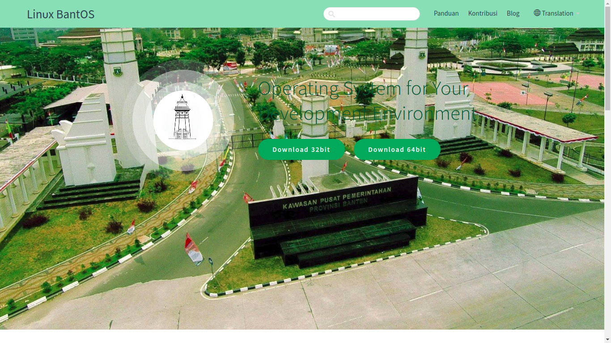](../images/tampilan-bantos.png)

Tampilan ini terdapat menu download,panduan,kontribusi,dan blog

## Tampilan halam panduan 
**Tampilan konten panduan**
[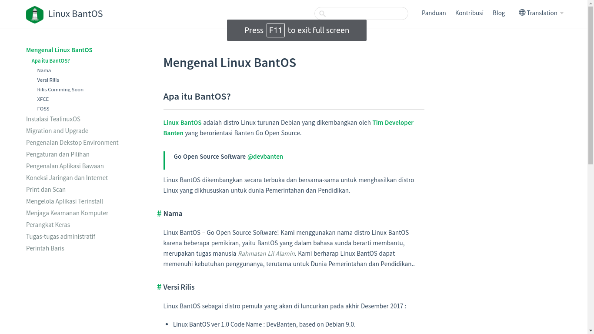](../images/tampilan-konten.png)

di dalam konten ini terdapat informasi mengenai panduan seperti :
1. apa itu bantos
2. instalasi tealinux
3. migration and upgrade
4. pengenalan desktop environment
5. pengaturan dan pilihan
6. pengenalan aplikasi bawaan
7. koneksi jaringan dan internet
8. print dan scan
9. mengelolaan aplikasi terinstall
10. menjaga keamanan komputer
11. perangkat keras
12. tugas tugas administratif
13. perintah baris

**Tampilan Apa Itu BantOS**

Tampilan ini menjelaskan apa itu BantOS

**Tampilan Instalasi TeaLinuxOS**
[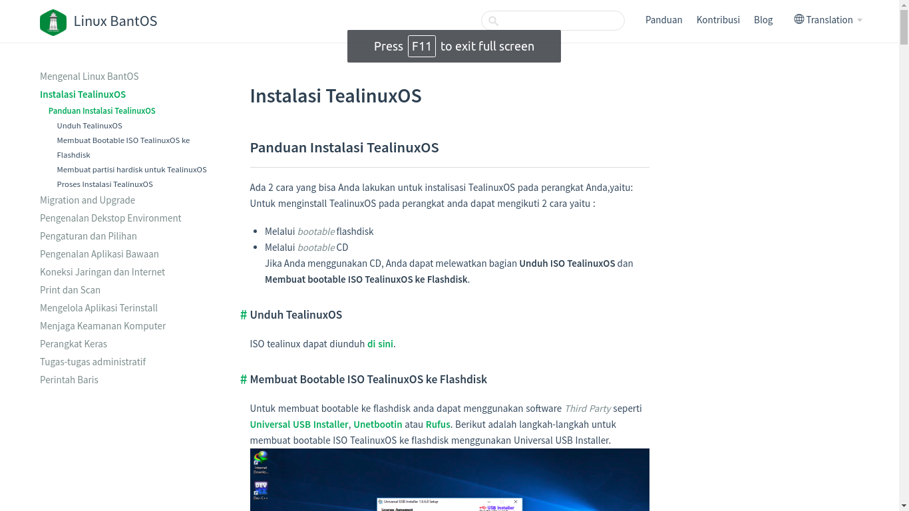](../images/instalasi-tealinuxos.png)
Tampilan ini menampilkan panduan  untuk instalasi linuxOS

**Migration and Upgrade**
[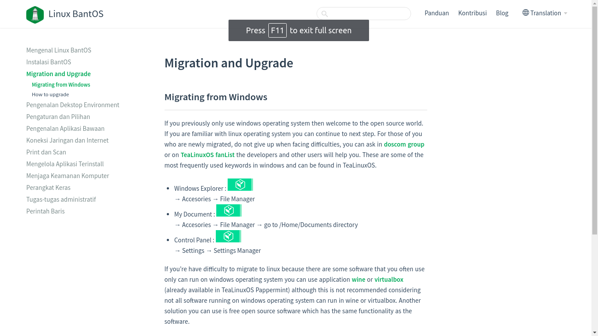](../images/migration-and-upgrade.png)
tampilan ini menampilkan panduan untuk migrasi dan upgrade data linuxOS

**Pengenalan Desktop Environment**
[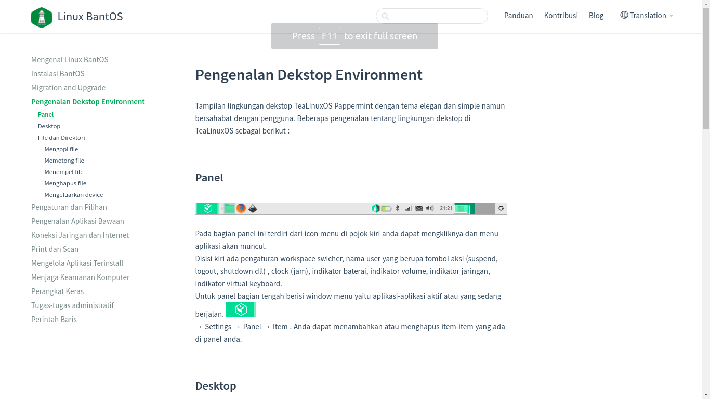](../images/penngenalan-desktop-environment.png)
Tampilan ini menampilkan Tampilan lingkungan dekstop TeaLinuxOS Pappermint dengan tema elegan dan simple namun bersahabat dengan pengguna.

**Pengaturan dan Pilihan**
[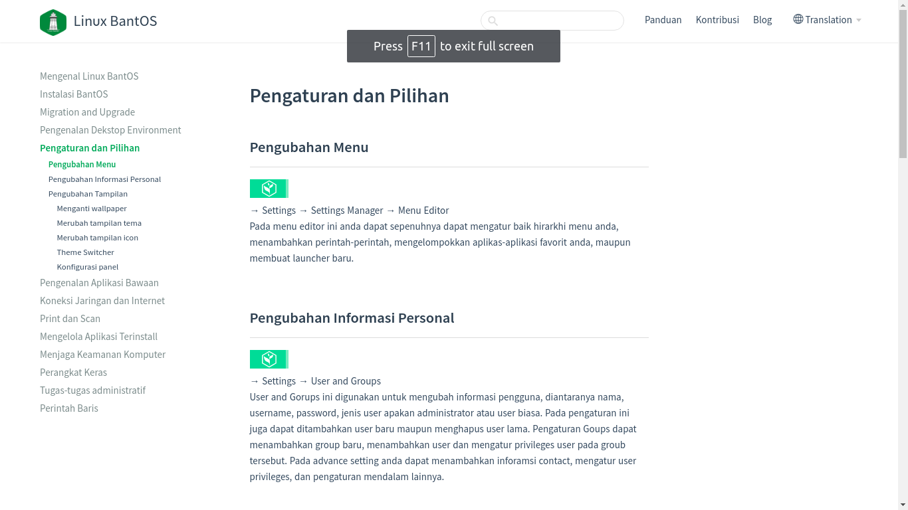](../images/pengaturan-dan-pilihan.png)
Tampilan ini menampilkan pengubahan menu,pengubahan informasi personal,perubahan tampilan,merubah tampilan tema,merubah tampilan icon

**Pengenalan Aplikasi Bawaan**
[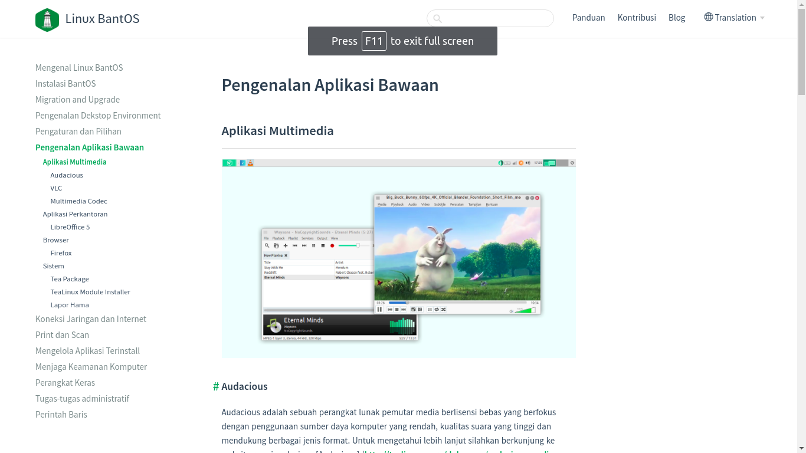](../images/pengenalan-aplikasi-bawaan.png)
Tampilan ini menjelaskan tentang sistem bawaan linux bantOS

**Koneksi Jaringan dan Internet**
[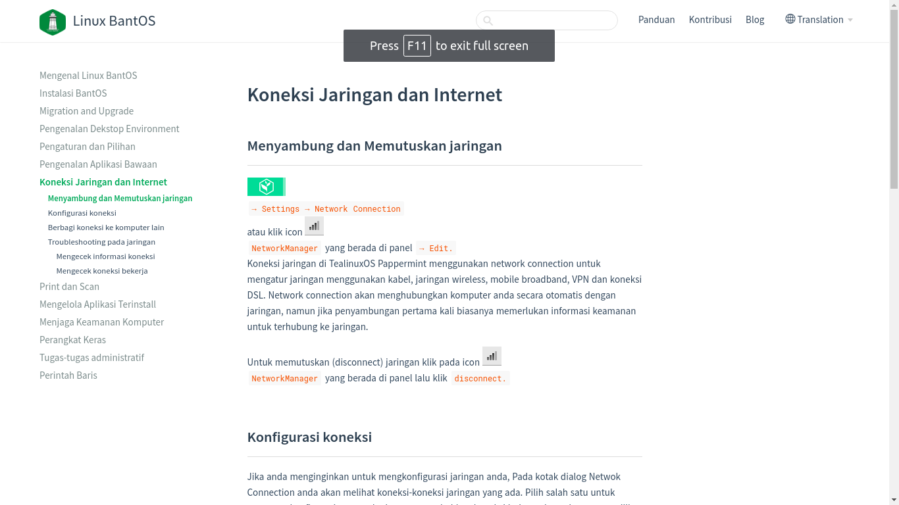](../images/koneksi-jaringan-dan-internet.png)
Tampilan ini mejelaskan tentang jaringan dan internet,mengecek jaringa,mengecek koneksi bekerja,dan mengecek informasi internet

**print dan scan** 
[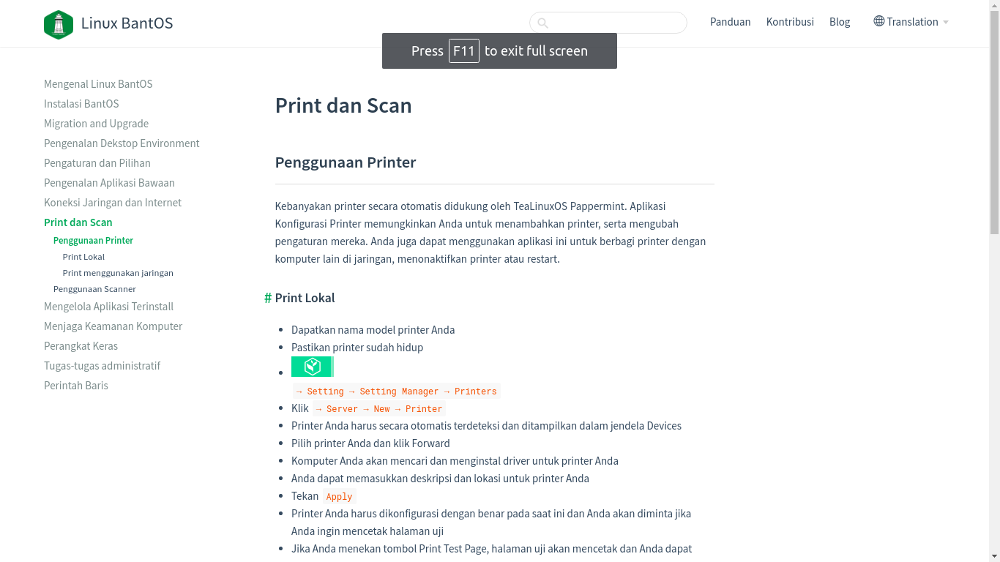](../print-dan-scan.png)
Tampilan ini menjelaskan penggunaan print lokal dan scan

**mengelolaan aplikasi terinstal**

Tampilan ini mejelaskan pengelolaan aplikasi terisntall seperti menginstall software linux dab dan ubuntu

**menjaga keamanan komputer**

Tampilan ini menjeleaskan mengubah password secara bekala dan kunci layar ketika meninggalkan komputer

**perangkat keras**
[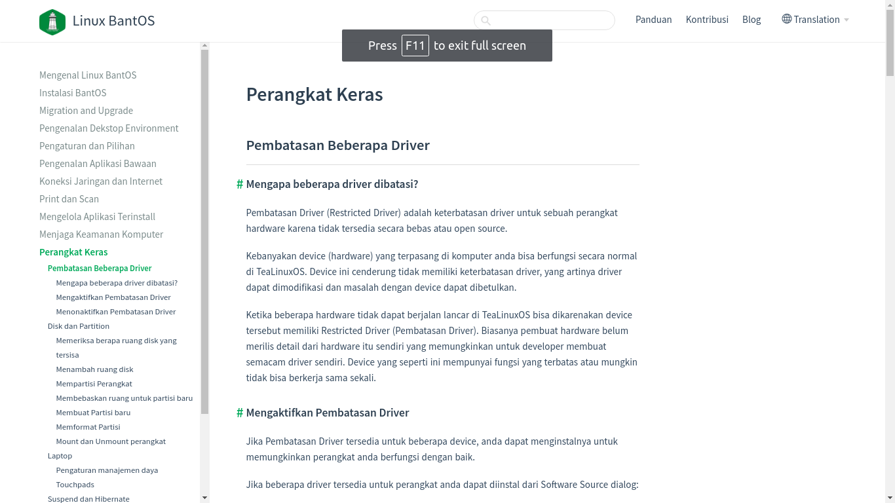](../images/perangkat-keras.png)
Tampilan ini menjelaskan pembatasan beberapa driver ,mengatifkan pembatas driver,dan menonaktifkan perangkat driver.

**tugas tugas administratif**
[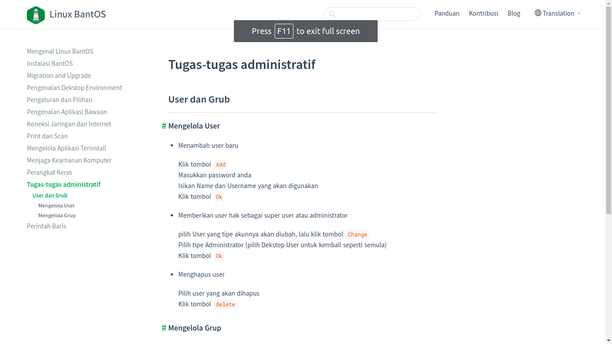](../images/tugas-tugas-administratif.png)
Tampilan ini menjelaskan mengelola user dan mengelola grup

**perintah baris**
[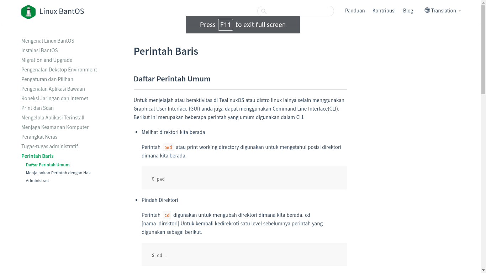](../images/perintah-baris.png)
Tampilan ini menjelaskan daftar perintah umum,menjalkan perintah hak,dan administrasi

## Kontribusi

TeaLinuxOS untuk berkontribusi dan terlibat melakukan perubahan pada pengembangan TeaLinuxOS. Meskipun kamu bukan seorang programmer, kamu bisa berkontribusi dan membuat perubahan.

## Blog
[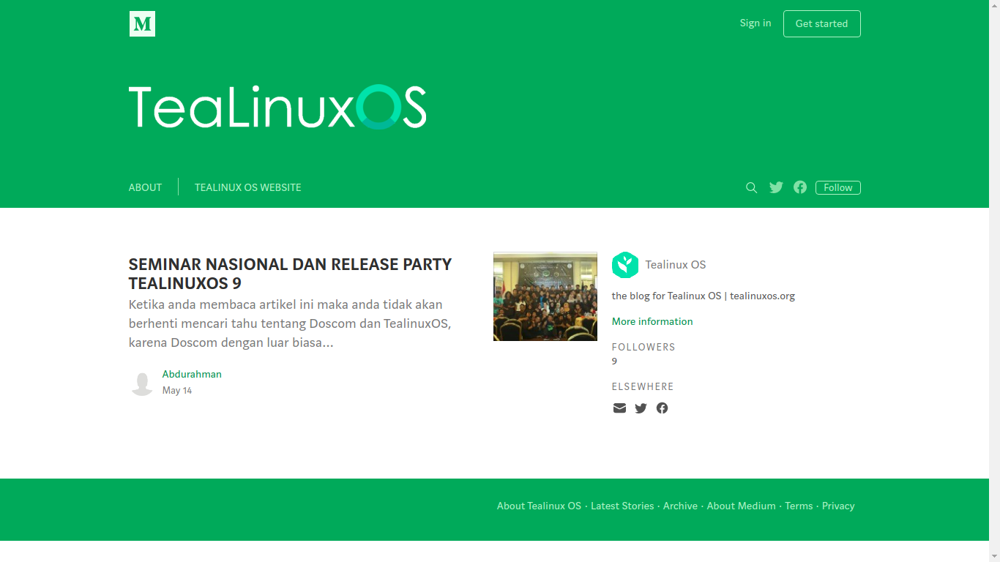](../images/blog.png)
Tampilan ini mampilkan blog tentang TeaLinuxOS
