# PALAPA

Palapa adalah sebuah aplikasi simpul jaringan berbasis *Open Source* (kode sumber terbuka) yang mendukung penyelenggaraan IG (Informasi Geospasial) meliputi pengumpulan, penyimpanan, pengamanan dan penyebarluasan di unit produksi dan unit pengelolaan dan penyebarluasan IG seperti yang pembuatannya berdasarkan dari UU No. 4/2011 tentang informasi Geospasial.

Dalam perkembangannya aplikasi PALAPA mengalami beberapa perubahan yaitu :
* Palapa versi 1
 Dikembangkan dengan teknologi *OpenSource OpenGeo*, belum *web responsive* dan belum terintegrasi dengan portal nasional.
* Palapa versi 2
 Dikembangkan dengan teknologi *OpenSource Opengeo* terbaru dan sudah *web responsive* namun belum memiliki manajemen metadata katalog.
* Palapa versi 3
Dikembangkan dengan teknologi *OpenSource* secara modular jadi lebih mudah ketika ada *updating* pada modul secara terpisah. Dibuatkan secara terpisah. Dibuatkan repository khusus, sehingga bisa melakukan *updating* secara *background* proses. Kemudian juga pada versi 3 mengakomodir konsep IG terpadu Katalog Unsur Geografi Indonesia (KUGI), manajemen katalog metadata yang tersinkronisasi ke portal nasional secara mudah dan sesuai standar ISO.

Aplikasi PALAPA mempunyai beberapa manfaat yaitu ;
* Berfungsi sebagai geoportal yang menyediakan katalog dan metadata serta layanan *Geographic Information System* (GIS) berbasis web (*GIS Web Services*).
* Bertujuan sebagai sarana berbagi data (*Sharing Data*), publikasi dan disseminasi (penyebaran inovasi yang direncanakan, diarahkan, dan dikelola) data.
* Sebagai salah satu sistem simpul jaringan Informasi Geospasial Nasional (JIGN).
* Penggunaan simpul jaringan yang sesuai standar (SNI dan ISO) dan peraturan yang berlaku (UU, Perpres dan Perka) yang mudah digunakan, mudah diaplikasikan, cepat dan informatif.

Penyelenggaraan Informasi geospasial (IG) dilakukan oleh setiap instansi / lembaga yang berperan sebagai produsen dan pengguna Data Geospasial (DG) dan Informasi Geospasial (IG). Dalam penyelenggaraan IG terdapat beberapa kegiatan yang meliputi :
* Pengumpulan Data Geospasial (DG)
* Pengolahan Data Geospasial (DG) dan Informasi Geospasial (IG)
* Pengamanan dan penyimapanan Data Geospasial (DG) dan Informasi Geospasial (IG)
* Penyebarluasan Data Geospasial (DG) dan Informasi Geospasial (IG)
* Penggunaan Informasi geospasial (IG)

Dalam penggunaannya PALAPA mempunyai beberapa *actor* yang mempunyai kegiatan yang berbeda - beda yaitu :
* Pengguna
 Pengguna dapat melakukan pencarian dan visualisasi data dan informasi geospasial yang tersedia pada simpul. Pengguna internal dapat mengunggah, mengelola dan membagi data informasi geospasial.

* Pengembang
 Pengembang mengembangkan aplikasi PALAPA menggunakan *project open source* yang terpercaya seperti *GeoServer, PostGIS, Open Layers dan pyCSW*. Para pengembang juga menyediakan API (*Application Progamming Interface*) yang dapat dikustomisasi dan diintegrasikan dengan aplikasi lainnya.

* Administrator
 Platform PALAPA dapat diandalkan dan dikembangkan untuk membangun aplikasi simpul jaringan sebagai bagian jaringan Informasi Geospasial nasional (JIGN). *Framework* yang digunakan mendukung standar *Open geospatial Consortium* (OGC) dan *International Organization for Standardization* (ISO). Disamping itu juga pengelolaan metadata yang terintegrasi dengan data dan informasi geospasial sehingga memudahkan bagi para administrator dalam menjalankan aplikasi PALAPA.

Didalam Desain aplikasi PALAPA terdapat beberapa fitur utama aplikasi yaitu ;
* Pencarian melalui katalog geospasial
* Pengelolaan, publikasi dan penyimpanan metadata
* Unggah (*upload*) dan unduh (*download*) DG / IG
* Penyajian peta yang interaktif
* mendukung standar dan terintegrasi dengan Pusat Sistem Jaringan (PSJ) Ina-geoportal

Teknologi yang digunakan dalam aplikasi PALAPA:
* WMS (*Web Map Service*)
* WFS (*Web Feature Service*)
* WCS (*Web Coverage Service*)
* TMS (*Tile Map Service*)
* CSW (*Catalogue Service of Web*)
* RDBMS (*Relational Database Management System*)
* API (Applicatiom Progamming Interface*)
* OGC Service Provider
    * GeoServer (*Web Map Service* (WMS), *Web Feature Service* (WFS), *Tile Map Service* (TMS))
    * pyCSW(*Catalogue Service of Web* (CSW))
* RDMB Provider
    * *Postgresql 9.x (dengan ekstensi GIS)
* Web Server
    * Tomcat (GeoServer)
    * Nginx (Front-end / Web-API dan Proxy)
* PALAPA *Management Front-End*
    * AngularJS Framework
    * OpenLayers 3 MAP Toolkit
    * Web-API buatan untuk akses ke GeoServer/pyCSW
* PALAPA *Client Front-End*
    * AngularJS Framework
    * OpenLayers 3 MAP Toolkit
    * Web-API buatan untuk akses ke GeoServer/pyCSW

## Desain Tampilan
* **Simpul Jaringan Pemerintah Daerah**
[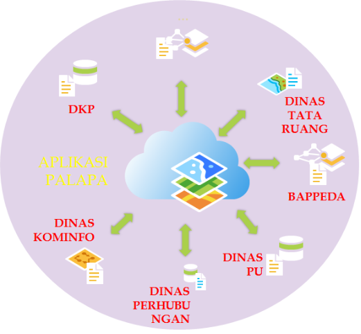](../images/design-aplikasi-palapa.png)

* **Arsitektur Aplikasi PALAPA - Elememn JIGN / Simpul Jaringan**
[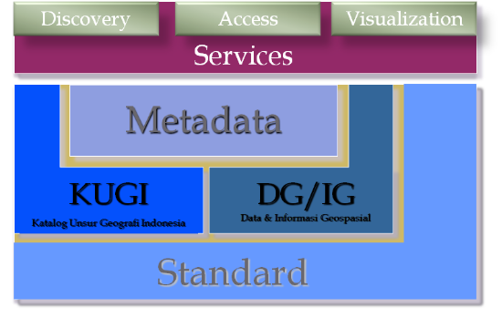](../images/untitled-diagram.png)

* **Arsitektur Simpul Jaringan**
[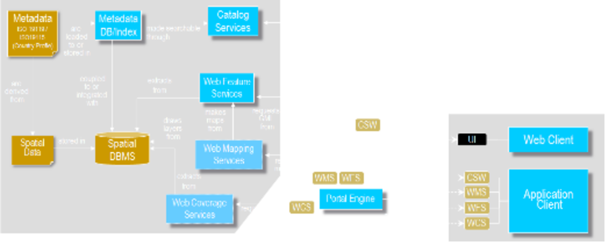](../images/arsitektur-simpul-jaringan.png)

* **Arsitektur PALAPA **
[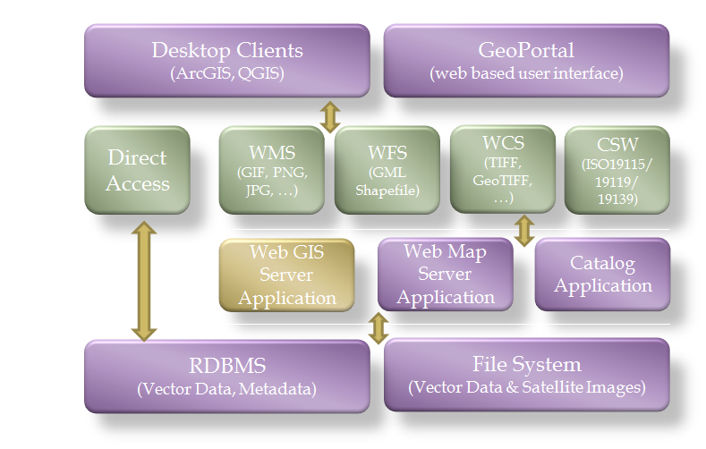](../images/arsitektur-aplikasi-palapa.png)

[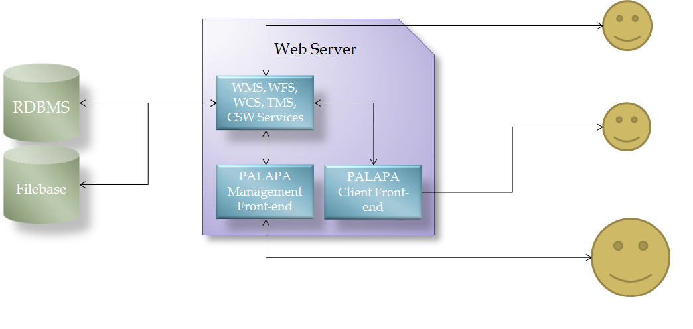](../images/arsitektur-aplikasi-palapa3.png)

* **Use Case Diagram - Browse / Explore**
[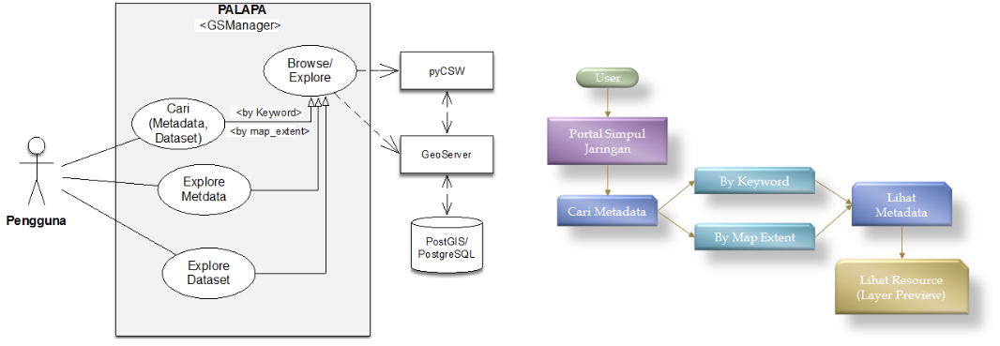](../images/use-case-diagram-browse/explore.png)

* **Use Case Diagram PALAPA**
[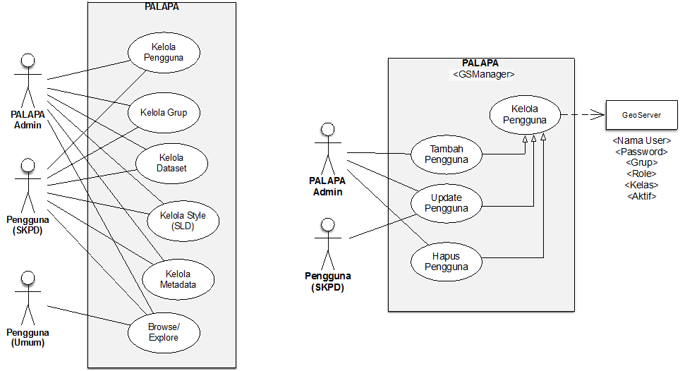](../images/use-case-diagram-palapa.png)

* **Use Case Diagram - Kelole Grup**
[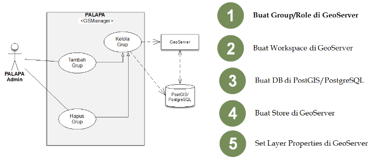](../images/use-case-diagram-kelola-group.png)

* **Use Case Diagram - Kelola Style (SLD)**
[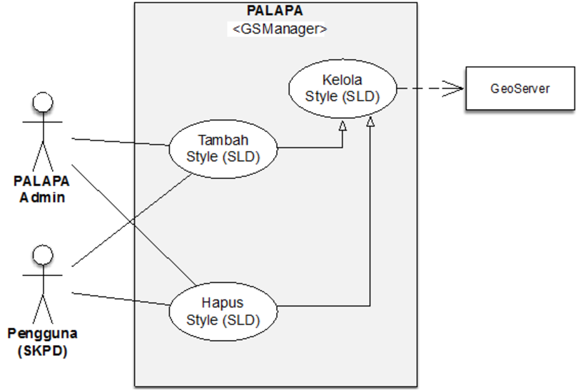](../images/use-case-diagram-kelola-style-sld.png)

* **Use Case Diagram - Kelola Dataset**
[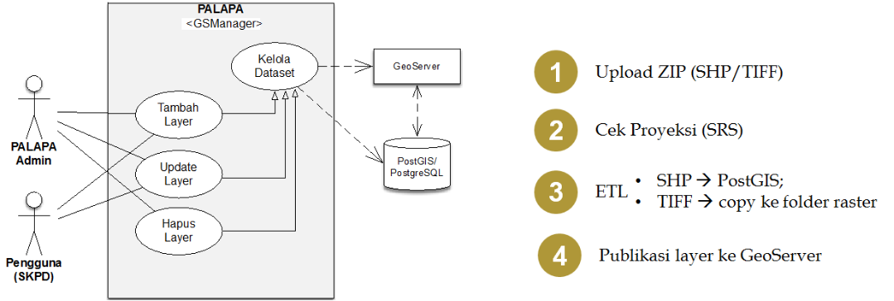](../images/use-case-diagram-kelola-dataset.png)

* **Kelola Dataset - KUGI**
[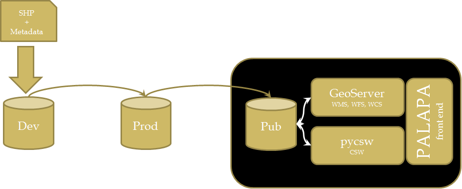](../images/kelola-dataset-kugi.png)

* **Kelola Dataset - KUGI Upload Dataset+Metadata ke Dev DB**

* **Kelola Dataset - KUGI DB Sync & Metadata Update**
[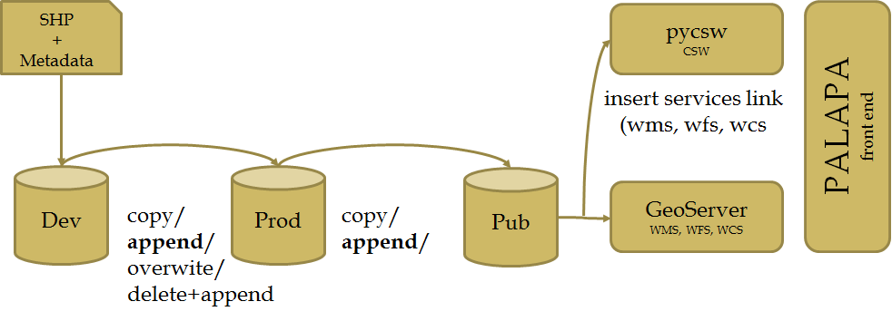](../images/kelola-dataset-kugi-db-sync.png)

* **Use Case Diagram - Kelola Metadata**

* **Tampilan Aplikasi PALAPA**
[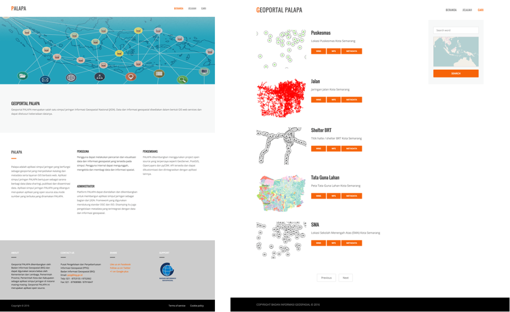](../images/tampilanaplikasipalapa.png)

[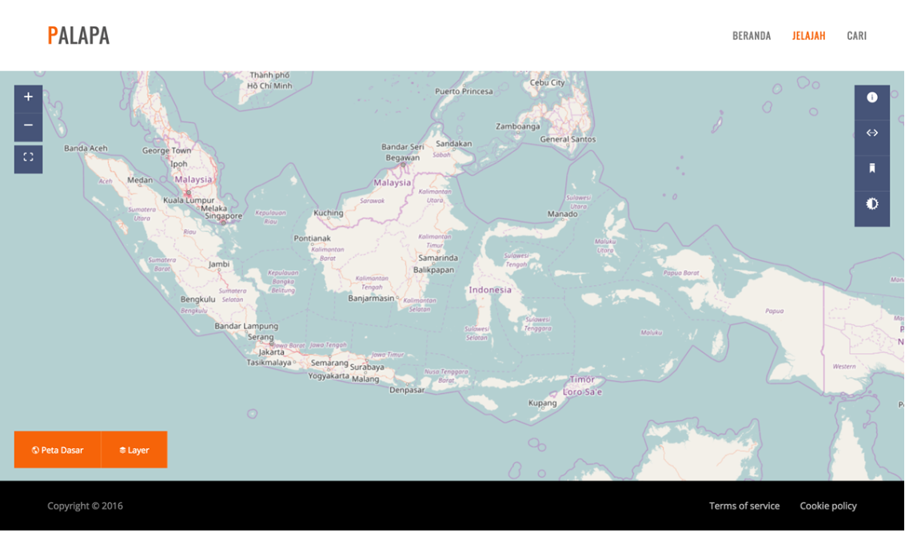](../images/tampilanaplikasipalapa2.png)

[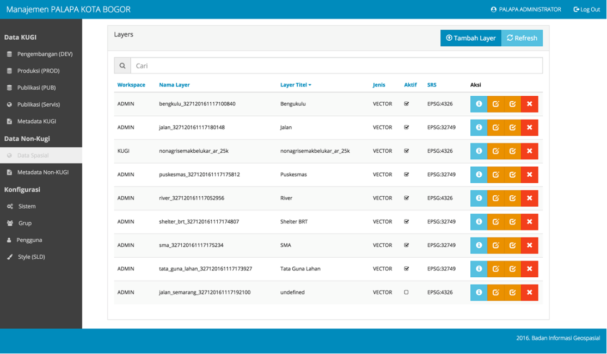](../images/tampilanaplikasipalapa3.png)
