[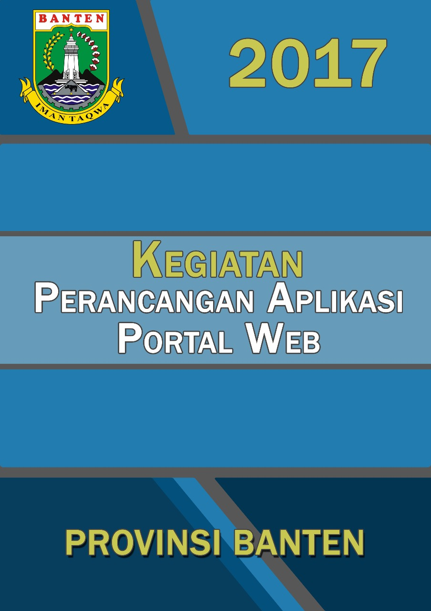](../images/20171110_cover-web-portal.jpeg)

## Abstrak
Pada akhir meledaknya bisnis dot-com pada tahun 1990-an, banyak pemerintah yang berkomitmen membuat situs portal sebagai layanan informasi bagi warganegara mereka. Di Amerika Serikat, portal utamanya adalah FirsGov.gov, di Inggris portal utama layanan informasi bagi warganegara adalah directgov dan busineslink.gov.uk untuk layanan informasi bisnis. Beberapa penelitian yang bersifat internasional dilakukan untuk mengukur kemampuan transaksional portal-portal ini, yang paling menyolok adalah penelitian yang diselenggarakan oleh Accenture. Website pemerintah daerah merupakan merupakan strategi *e-goverment* dengan sasaran agar maysarakat dapat dengan mudah memperoleh akses informasi. Untuk mencapai sasaran tersebut maka semua informasi perlu dikumpulkan dalam satu wadah portal web yang dapat dengan mudah diakses oleh masyarakat. dengan adanya web portal pemerintah ini dapat memudahkan masyarakat dalam mencari informasi tentang kegiatan dan info yang terdapat dipemerintah.

## Daftar Isi
**Cover**
**Abstrak**
**Daftar Isi**
**1. Pendahuluan**
1.1 Latar Belakang
1.2 Tujuan
1.3 Karakteristik Produk
1.4 Keluaran yang Diinginkan
**2. Metode Penelitian**
2.1 Metode yang Digunakan
2.2 Metode Pengumpulan Data
2.3 Metode Analisis
2.4 Ruang Lingkup Sistem Informasi / Aplikasi
2.5 Waktu dan Jadwal Pelaksanaan dan Lokasi Kegiatan
2.6 Model *E-Goverment*
**3. Hasil dan Pembahasan**
3.1 Perencanaan Aplikasi
3.2 Perancangan Sistem
3.2.1 Use Case Diagram
3.2.2 Activity Diagram
3.2.3 Sequence Diagram
3.2.4 State Chart Diagram
3.2.5 Deployment Diagram
3.2.6 Technology Stack Diagram
3.3 Tahapan Pekerjaan
3.3.1 Analisis Perancangan
3.3.2 Pembangunan Sistem
3.3.3 Integrasi dan Pengujian
3.4 Hasil
**4. Penutup**

## 1. Pendahuluan
### 1.1 Latar Beakang
*E-government* menjadi proses pemanfaatan tekhnologi informasi sebagai media untuk membantu menjalankan sistem pemerintahan secara lebih efektif dan efisien. Sebagai wujud dari penerapan e-government di Indonesia salah satunya adalah dengan pembuatan website pemerintah daerah.
Pembuatan website bagi pemerintah daerah di Indonesia merupakan implementasidari Instruksi Presiden No. 3 Tahun 2003, yang isinya memanfaatan teknologi informasi (internet) dalam menunjang aktivitas pemerintahannya, baik pemerintah pusat maupun pemerintah daerah menuju terwujudnya *e-government* di Indonesia.

Pemerintahan yang baik harus memiliki sebuah wadah informasi yang dapat menjadi prasarana bagi masyarakat untuk mengetahui kegiatan kepemerintahan maupun info yang meliputi *Government to Government (G2G), Government to Employees (G2E), Government to Bussiness (G2B)* dan *Governtment to Citizen (G2C)* yang nanti akan terhubung langsung  terhubung dengan website yang ada.

Saat ini belum terdapat portal yang menampung informasi yang ada di Banten sehingga jika mnasyarakat ingin mencari suatu informasi ia harus mencari website terkait dengan informasi yang dicari, sehingga agak merepotkan bagi masyarakat. Dengan adanya portal web ini diharapkan dapat membantu masyarakat dalam mencari informasi dan dinas terkait yang ingin men*share* informasi yang ia punya.

### 1.2 Tujuan
Tujuan dari perancangan portal web ini adalah sebagai berikut:
 1. Mempermudah masyarakat dalam mencari informasi
 2. Wadah informasi dari semua dinas / OPD yang ada

### 1.3 Karakteristik Produk
 1. dapat menyajikan informasi dari dinas / OPD terkait
 2. Dikembangkan menggunakan *frmaework* atau biasa dikenal dengan berbasis web
 3. *User Friendly* (menggunakan *interface* / antarmuka yang mudah digunakan oleh *user*

### 1.4 Keluaran yang diinginkan
 1. Tersedianya situs portal pemerintah Provonsi Banten bagi sistem informasi/aplikasi/website
 2. Tersedianya dokumentasi API yang digunakan

## 2. METODE PENELITIAN
Untuk memperoleh data yang dapat menunjang aplikasi ini, maka di perlukan data teoritis dan data dinas terkait untuk mendapatkan data dan informasi yang berhubungan dengan aplikasi ini.
Adapun penyusun melakukan beberapa penelitian yang dilakukan dengan :
### 2.1 Metode yang Digunakan

Menggunakan metode *Prototyping* untuk melakukan perancangan sistem informasi berbasis web.

* Ilustrasi alur *Prototyping*

### 2.2 Metode Pengumpulan Data
Untuk mengumpulkan data yang diperlukan untuk membangun sistem ini diadakan wawancara dan studi pustaka. Pengumpulan data ini dilakukan untuk mengetahui permasalahan dan gambaran sistem yang sedang berjalan sehingga dapat mengembangkannya untuk membentuk sistem baru yang dapat mendukung sistem yang sedang berjalan.
* Wawancara ini dilakukan kepada Pemprov Banten. Wawancara dilakukan kepada sistem analist Pemprov Banten untuk mengetahui permasalahan dalam proses pendataan yang sedang berjalan sekarang.
* Studi pustaka, melakukan pengumpulan informasi dari buku text, internet sebagai referensi.

### 2.3 Metode Analisis
Tim pengembang aplikasi akan melakukan analisis jika diperlukan dapat dilakukan survey pendahuluan untuk melihat sejauh mana kebutuhan pengguna akan sistem yang akan dibangun, fasilitas yang akan dibangun, data-data yang dibutuhkan, dll. Dalam analisis ini dilakukan diskusi-diskusi baik dengan bagian terkait pada satuan kerja.

### 2.4 Ruang Lingkup Sistem Informasi / Aplikasi
 1. Menyediakan situs portal pemerintah seabgai wadah untuk semua informasi yang terdapat di setiap dinas / OPD ysng terdapat dilingkungan pemerintah provinsi Banten
 2. Menyediakan proses pengajuan pengadaan / pengembangan sistem informasi / aplikasi /website secara digital untuk seluruh Organisasi Perangkat Daerah dilingkungan Pemerintah Provinsi Banten. 
 
### 2.5 Waktu dan Jadwal Pelaksanaan dan Lokasi Kgiatan
 1. Waktu Pelaksanaan kegiatan : 4 bulan sejak dikeluarkan SPK sampai dengan Pemakaian
 2. Lokasi Kegiatan : Kantor OPD terkait dan Dinas Komunikasi Informasi Statistika dan Persandian Pemerintah Provinsi Banten

### 2.6 Model *E-Government*
Banyak instansi pemerintah telah memanfaatkan revolusi digital dan menyediakan berbagai layanan pemerintah dan layanan informasi publik secara online untuk para pemangku kepentingan *E-Government*. Bersdasarkan pemangku kepentingan model *e-government dapat dibedakan menjadi 4 yaitu :

| **Model *E-government***    |      **Interaksi Antar Pemangku Kepentingan**       |
|:----------: |:-------------: |
| Pemerintah ke Masyarakat (G2C) | Penyampaian layanan publik dan informasi satu arah oleh pemerintah kepada masyarakat |
| Pemerintah ke Bisnis (G2B) | Terdiri dari transaksi - transaksi elektronik dimana pemerintah menyediakan berbagai informasi yang dibutuhkan kalangan bisnis untuk bertransaksi dengan pemerintah |
| Pemerintah ke Pegawai (G2E) | Terdiri dari berbagai inisiatif yang memfasilitasi manejemen pelayanan dan komunikasi internal dengan pegawai pemerintah, contohnya : Sistem Informasi Kepegawaian * online* |
| Pemerintah ke Pemerintah (G2G) | Memungkinkan komunikasi dan pertukaran informasi online antar departemen/satuan kerja atau lembaga/instansi pemerintah melalui database terintegrasi.  |

## 3. Hasil dan Pembahasan
### 3.1  Perencanaan Aplikasi 
Sistem informasi portal adalah wadah untuk mengumpulkan informasi-informasi tentang kepemerintahan, yang dmana sistem ini akan mempermudah masyarakat dalam mencari informasi yang ada di kepemerintahan.

### 3.2 Perancangan Sistem
Permodelan rancangan sistem yang digunakan adalah UML *(Unified Modeling Language)*. Menurut Whitten dan Bentley (2007, p.381), Unified Modeling Language adalah kumpulan rancangan diagram untuk membangun sebuah sistem atau aplikasi yang dimana setiap diagram menyediakan sistem informasi kepada tim pengembang dengan berbagai sudut pandang yang berbeda – beda. UML yang digunakan terdiri dari use case diagram, activity diagram, sequence diagram, state chart diagram, deployment diagram dan technology stack diagram.

#### 3.2.1 *Use Case Diagram*
[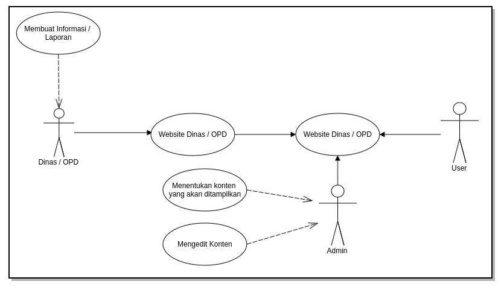](../images/20171026_use-case-portal.png)

#### 3.2.2 *Activity Diagram*
* *Activity Diagram* Dinas / OPD
[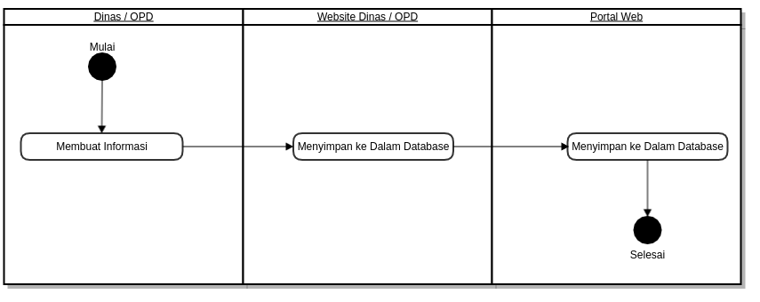](../images/20171026_activity-diagram-portal-dinas-opd.png)

* *Activity Diagram* User

* *Activity Diagram* Admin

#### 3.2.3 *Sequence Diagram*
[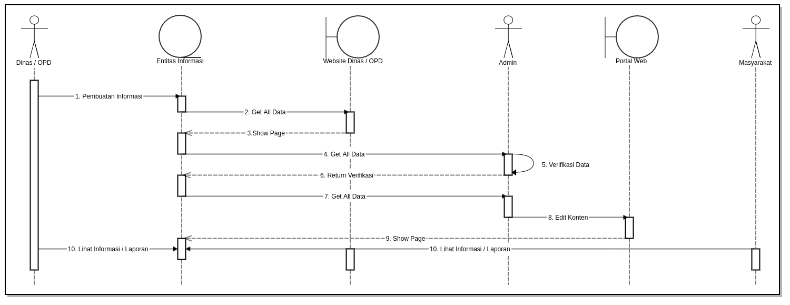](../images/20171027_sequence-diagram-portal.png)

#### 3.2.4 *State Chart Diagram*
* *State Chart Diagram* Dinas / OPD
[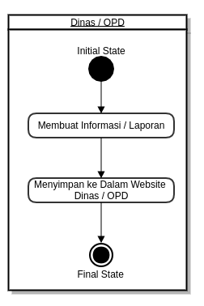](../images/20171026_state-chart-diagram-portal-dinas-opd.png)

* *State Chart Diagram* User
[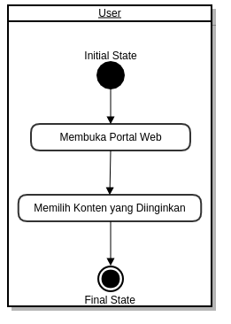](../images/20171026_state-chart-diagram-portal-user.png)

* *State Chart Diagram* Admin
[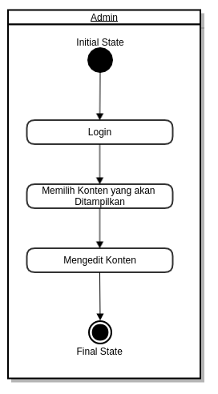](../images/20171026_state-chart-diagram-portal-admin.png)

#### 3.2.5 Deployment Diagram
[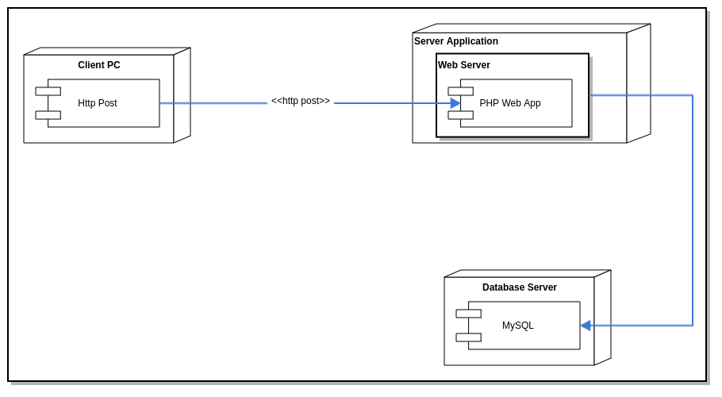](../images/20171013_deployment-diagram.png)

#### 3.2.6 Technology Stack Diagram
[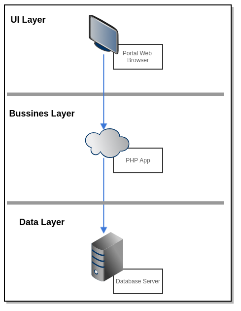](../images/20171026_technology-stack-diagram.png)

### 3.3 Tahapan Pekerjaan
Tahap-tahap atau langkah yang dilakukan dalam mengembangkan Sistem Informasi Portal Web adalah sebagai berikut:
#### 3.3.1 Analisis dan Perancangan
* Anaisis
Tim pengembang aplikasi akan melakukan analisis jika diperlukan dapat dilakukan survey pendahuluan untuk melihat sejauh mana kebutuhan pengguna akan sistem yang akan dibangun, fasiitas yang akan dibangun, data-data yang dibutuhkan, dll. Dalam analisis ini akan dilakukan diskusi-diskusi dengan bagian terkait pada satuan kerja.
* Perancangan Sistem
Perancangan sistem dilaksanakan setelah proses analisis dilaksanakan dan telah disepakati modul dan prosedur-prosedur yang akan diterapkan dalam sistem.

#### 3.3.2 Pembangunan Sistem
Setelah proses analisis dan perancangan sistem selesai dilakukan, tahapan selanjutnya adalah pembangunan sistem, yang meliputi kegiatan: pembuatan struktur database, pembuatan kode program/coding, pembuatan laporan-laporan.

#### 3.3.3 Integrasi dan Pengujian
* Integrasi
Setelah proses pengembangan sistem selesai dilakukan, tahapan selanjutnya adalah Integrasi sistem, yang meliputi kegiatan: pembuatan struktur database terkait integrasi, pembuatan kode program/coding terkait integrasi, pembuatan laporan-laporan terkait integrasi.
* Pengujian
Sistem yang telah selesai dibuat akan diuji coba menggunakan data test sebelum sistem dijalankan. Dalam uji coba sistem ini akan diterapkan metode *prototype*, yaitu jika terjadi kesalahan/kekurangan baik proses maupun *output* sistem, maka kesalahan/kekurangan tersebut akan diperbaiki/ditambahkan, sehingga memungkinkan pengembang untuk kembali ke tahapan pertama yaitu analisa (jika kekurangan sistem memang tidak terdefinisikan dalam dokumen perancangan sistem).

### 3.4 Hasil
Berikut ini adalah hasil eksekusi sistem informasi portal
1. Layout Tampilan Pada Admin
* Layout Tampilan Login Admin

* Layout Tampilan Dashboard Admin
[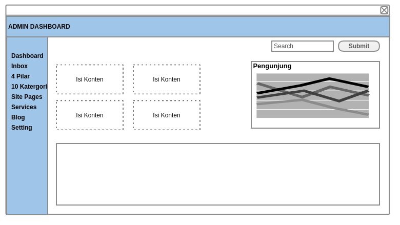](../images/20171027_design-tampilan-memilih-dashboard-admin.png)

2. Layout Tampilan User
* Layout Tampilan Depan
[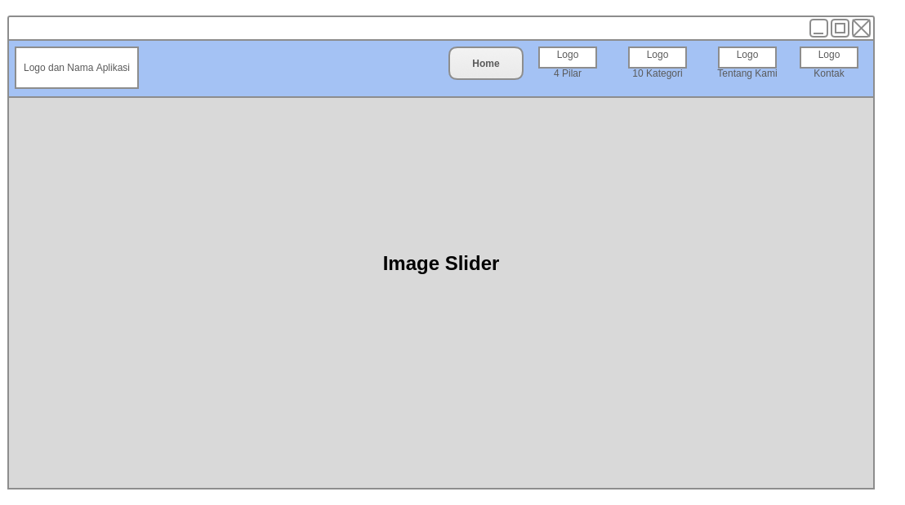](../images/20171026_design-tampilan-halamam-depan.png)

* Layout Tampilan Memilih Konten
[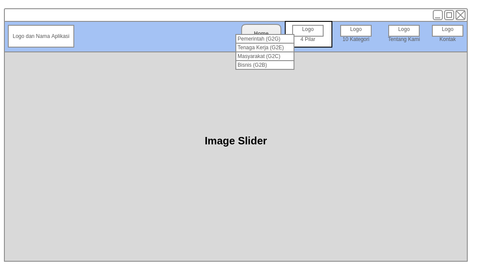](../images/20171026_design-tampilan-memilih-konten.png)

* Layout Tampilan Memilih Sub Konten
[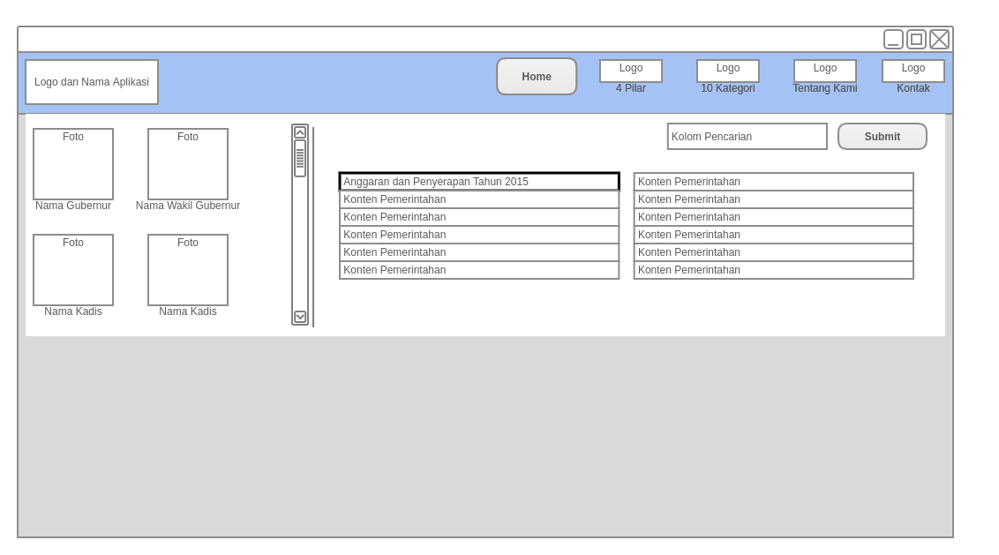](../images/20171026_design-tampilan-memilih-sub-konten.png)

* Layout Tampilan Melihat Info Sub Konten
[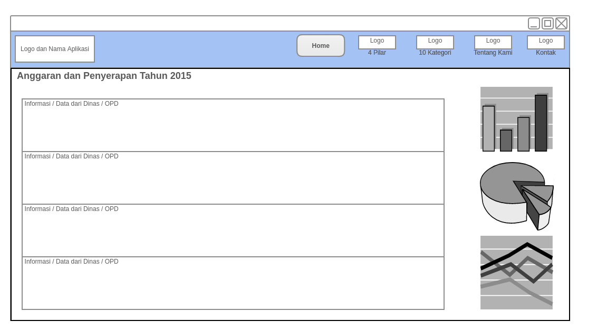](../images/20171026_design-tampilan-lihat-info-sub-konten.png)

## 4. Penutup
Dengan adanya pembuatan dari sistem informasi portal ini dapat membantu dalam mencari informasi atau laporan yang terdapat di pemerintahan Banten, sehingga masyarakat tidak bingung jika ingin mencari informasi atau laporan yang ada.