# MANUAL BOOK WEBEBSITE DAN APLIKASI ANDROID EPORMAS

### Layanan Online Epormas
EPORMAS adalah sebuah aplikasi yang berbasis webite dan android yang dikeluarkan oleh Pemerintah Provinsi Banten untuk mendukung terlaksananya proses pengaduan atau keluhan yang mewadahi atau dapat menjadi suatu alat informasi bagi masyarakat dalam menyampaikan informasi keluhan atau pengaduan yang dialami oleh masyarakat kepada dinas-dinas terkait agar proses perbaikan nya cepat dan terorganisir karena memanfaatkan sistem berbasis web dan android.

Berikut ini adalah cara penggunaan fitur-fitur yang terdapat didalam apliaksi EPORMAS:

#### Akses Website Epormas
Untuk melalui akses website, pengguna atau masyarakat dapat melakukan langkah-langkah sebagai berikut:
Buka situs website **EPORMA** di http://epormas-01.dev.bantenprov.go.id/

**Tampilan Awal EPORMAS**
[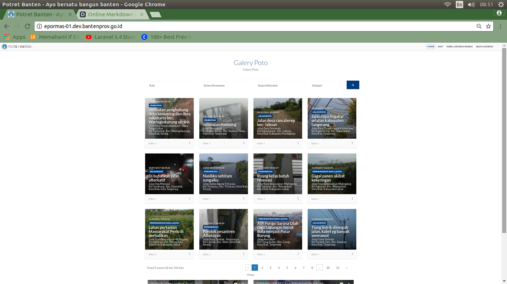](../images/tampilan-awal.png)

Didalam *page* ini pengguna atau masyarakat dapat melihat keluhan beserta informasi tentang yang dialami oleh masyarakat. Tampilan ini terdapat Home, Map, Tabel Laporan Warga, dan Buat Laporan.

## Tampilan Halaman Home 
**Tampilan Home**
[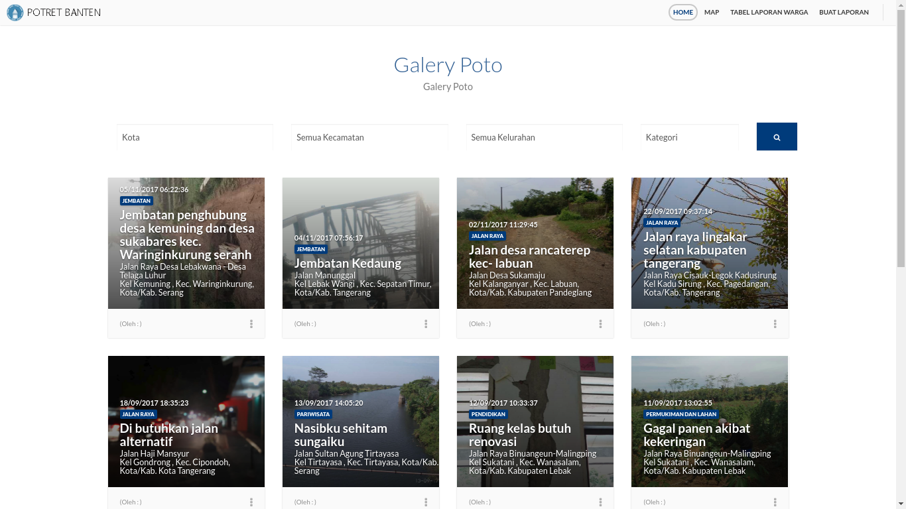](../images/tampilan-home.png)
Dalam konten ini pengguna atau masyarakat dapat melihat berita keluhan beserta informasi tentang yang dialami oleh masyarakat sesuai lokasi pelaporan.

## Tampilan Map 
**Tampilan Konten Peta Laporan Warga Banten**
[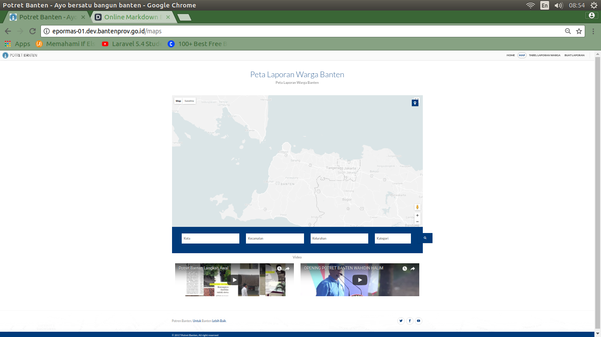](../images/tampilan-map.png)
Tampilan ini menjelaskan tentang peta laporan warga banten.

## Tampilan Tabel Laporan Warga 
**Tampilan Konten Tabel Laporann**
[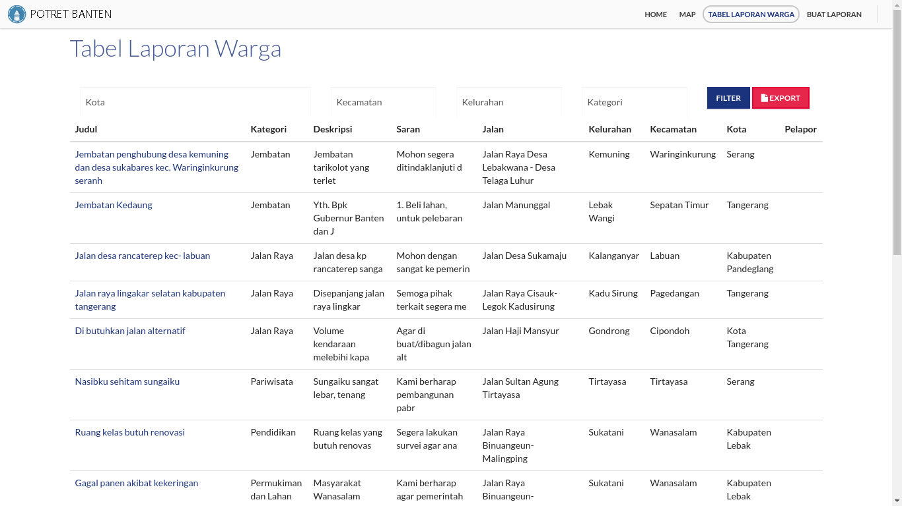](../images/tampilan-tabel-laporan.png)
Tampilan ini menjelaskan tentang kategori, deskripsi, kritik dan saran, lokasi, keluhan masyarakat. Konten Filter ini menjelaskan tentang *user* bisa melakukan penyaringan file tabel laporan warga. Konten Export ini menjelaskan tentang users bisa melakukan Export file tabel laporan warga dalam format Excel.

## Tampilan Form Buat Laporan
**Tampilan Konten Laporan Warga Banten**
[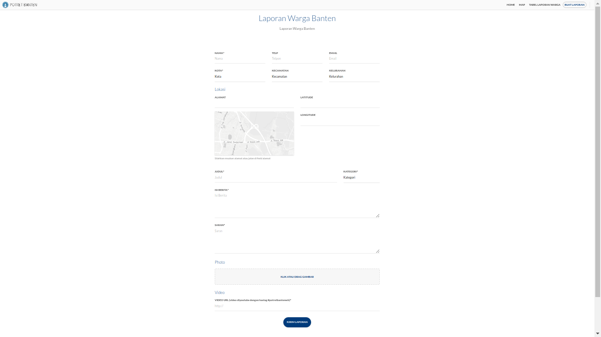](../images/tampilan-form-buat-laporan.png)
Didalam *page* ini terdapat *form input* yang harus diisi oleh user untuk bisa menambahkan  pengaduan atau keluhan masyarakat. Jika terdapat kesalahan dalam pengisian baik sudah lengkap maupun kurang lengkap pengisian data, maka secara otomatis akan kembali kedalam *page form input* dan jika berhasil dan sudah lengkap klik kirim laporan.

## Akses Aplikasi EPORMAS di Android
**Buka Aplikasi Appstore di Anda**
**Lalu cari dengan nama "Epormas" atau dengan kata kunci "Enstra Media"**
**Install Epormas**
**Tampilan Awal Epormas Setelah selesai penginstalan aplikasi Epormas,**
[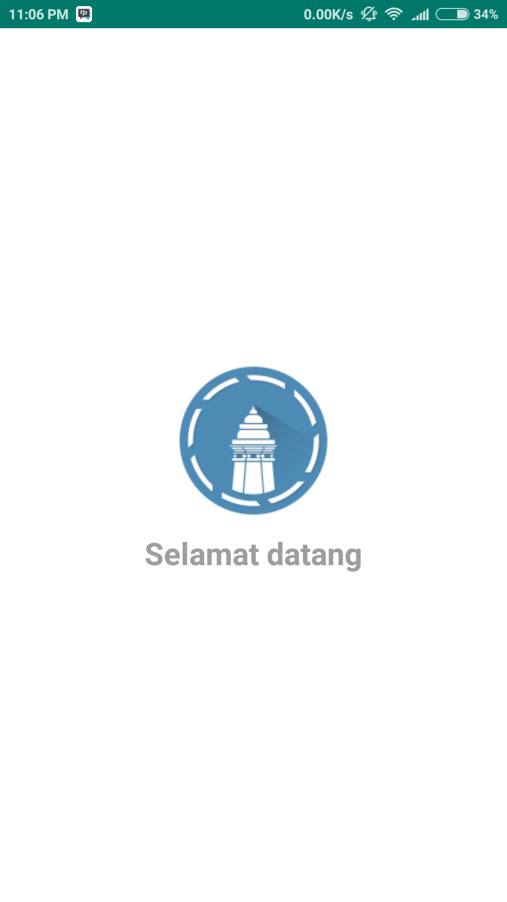](../images/tampilan-awal-android.png)

**Tampilan Regitrasi**
[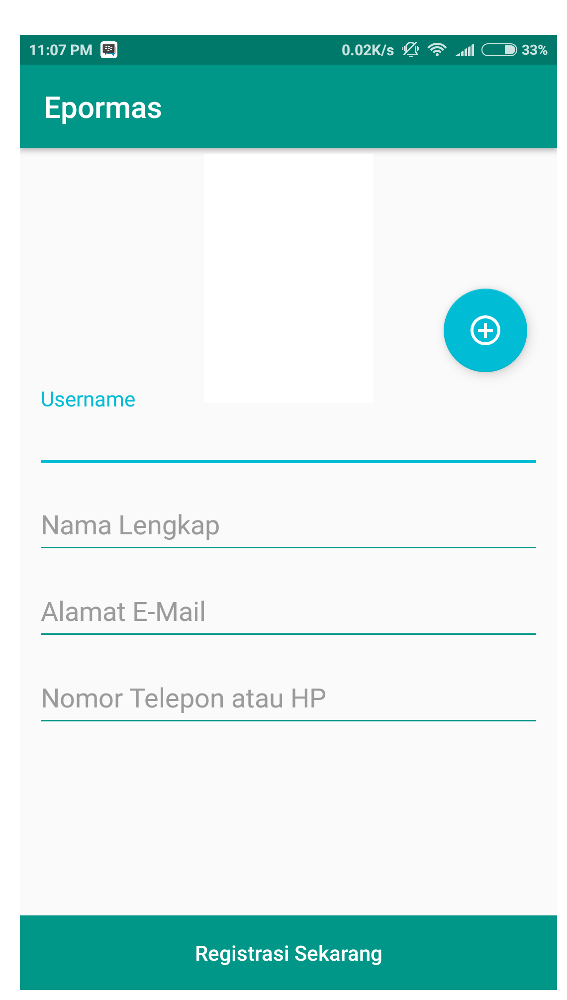](../images/tampilan-registrasi.png)
[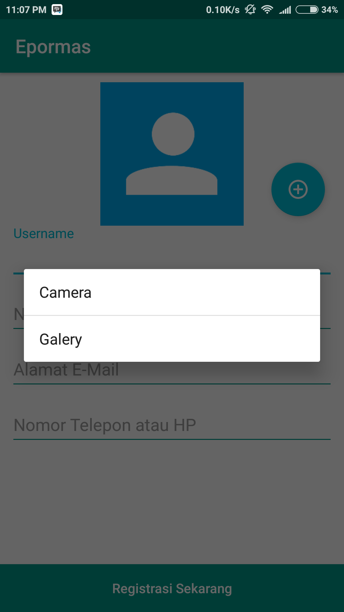](../images/tampilan-uploadfotouser.png)
Didalam *page* ini terdapat *form input* yang harus diisi oleh user untuk bisa menambahkan data user nama lengkap, alamat email, nomor telepon atau hp dan upload foto user.

**Tampilan Menu Epormas**
[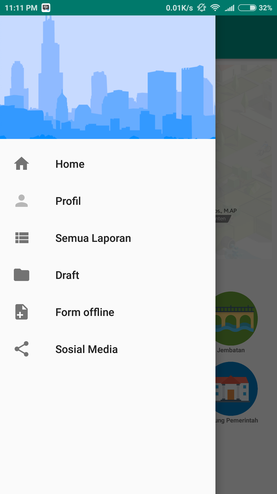](../images/tampilan-menu.png)
Didalam *page* ini terdapat menu home, profile, semua laporan, draft, form offline, social media. 

**Tampilan Menu Home**
[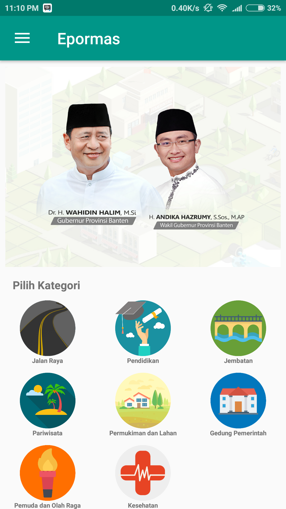](../images/tampilan-menu-home.png)
Didalam *page* ini terdapat fitur pilih kategori jalan raya, pendidikan, jembatan, pariwisata, pemukiman dan lahan, gedung pemerintah, pemuda dan olahraga, dan kesehatan.

**Tampilan Form Online Pilih Kategori Pengaduan**
[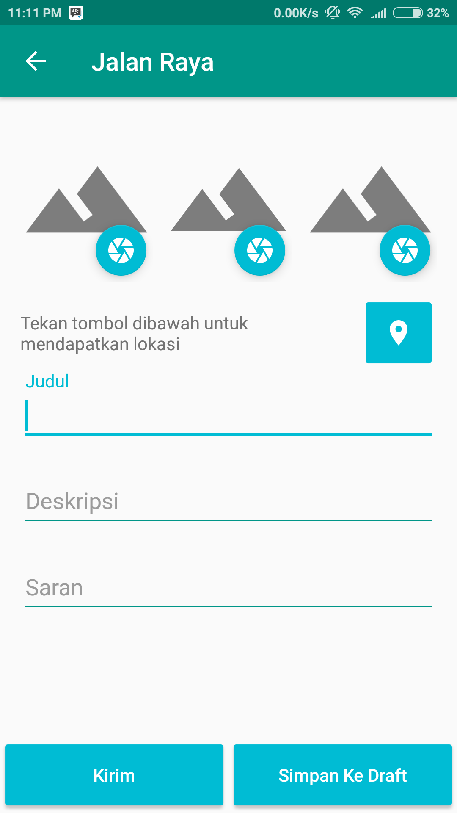](../images/tampilan-form-online.png)
Didalam tampilan ini ada form pengisian Judul, Deskripsi, Saran, Upload Foto, dan lokasi keluhan masyarakat. Setelah selesai pengisian lengkap user bisa pilih Kirim dan Simpan Ke Draft.

**Tampilan Menu Profile**
Didalam *page* ini terdapat fitur *page* biodata dan laporan user.
[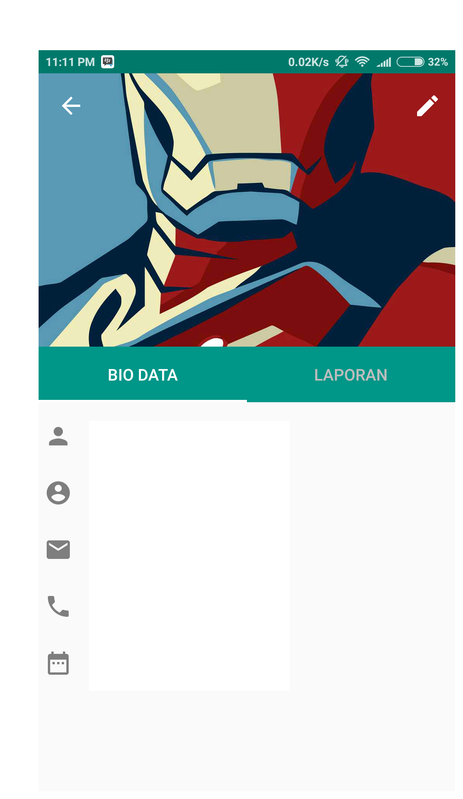](../images/tampilan-biodata.png)
[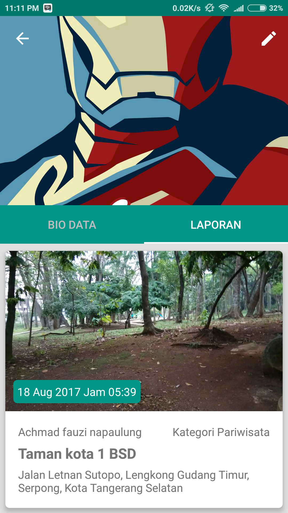](../images/tampilan-profil-laporan.png)

**Tampilan Menu Semua Laporan**
Didalam *page* ini terdapat *page* semua laporan user.
[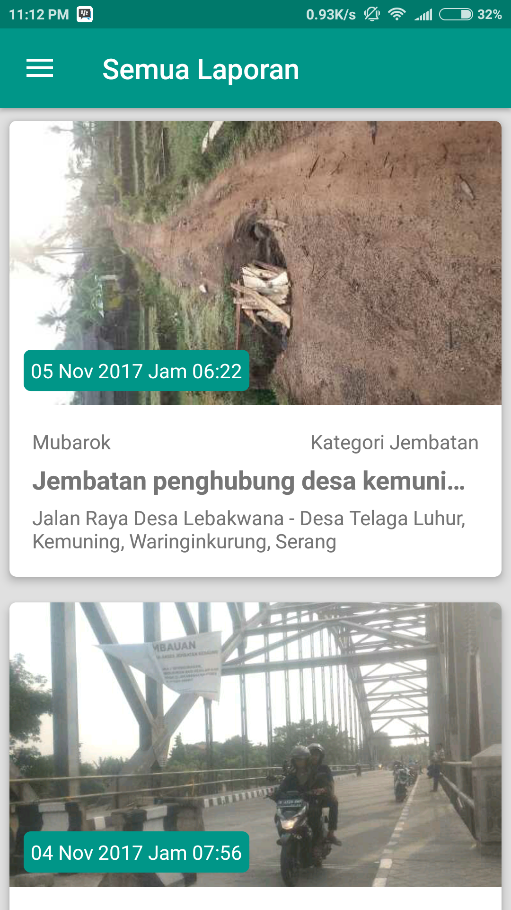](../images/tampilan-menu-semualaporan.png)

**Tampilan Menu Draft**
[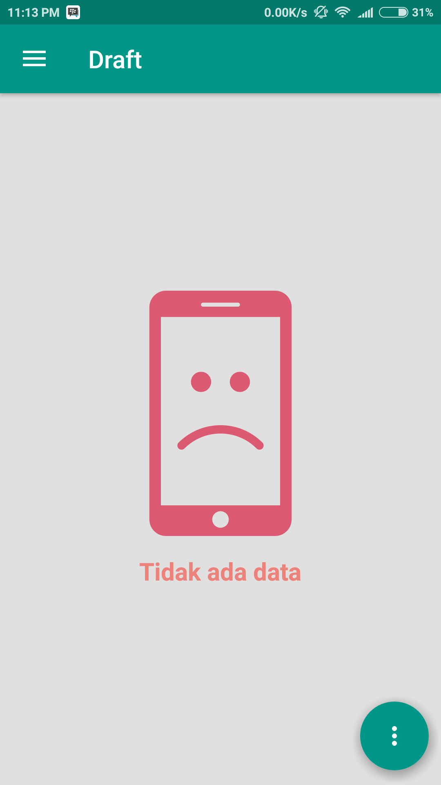](../images/tampilan-draft.png)
Didalam *page* ini terdapat kumpulan semua ide-ide user yang belum dikirim oleh user.

**Tampilan Menu Form Offline**
[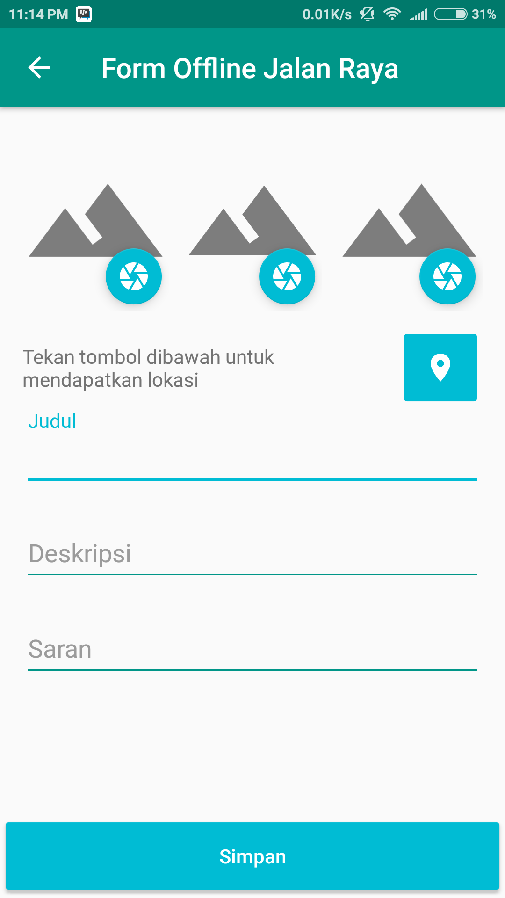](../images/tampilan-form-offline.png)
Selain online Epormas juga menyediakan *page form offline*. User dapat menyimpan laporan keluhan atau pengaduan yang di alami masyarakat di *form offline*.

**Tampilan Menu Social Media**
[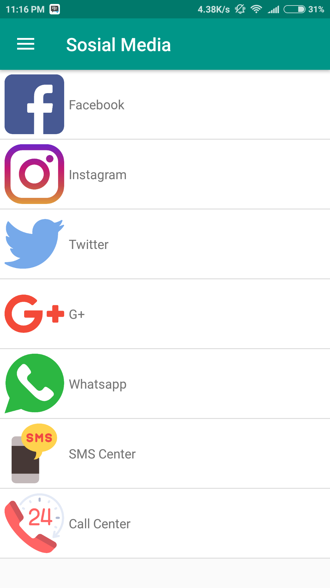](../images/tampilan-socialmedia.png)
Didalam *page* ini user bisa share ke social media terdapat fitur facebook, instagram, twitter, google+, whatsapp.

